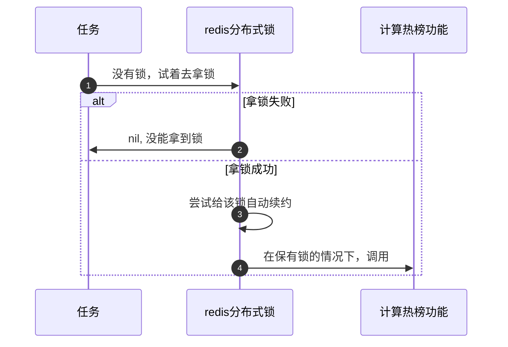

## 思路
原本是在确定拿到了Redis锁，才运行的热榜计算服务。  
那么现在就是得
- 在拿锁前，先读一下当前的负载
  - 如果低负载，去试着拿锁
  - 高负载，直接睡个5分钟再来读一下负载，判断拿不拿锁
- 在拿锁后，变成了高负载，也会释放掉锁

### 原来的执行逻辑

```mermaid
sequenceDiagram
autonumber
任务->>redis分布式锁: 没有锁，试着去拿锁
alt 拿锁失败
redis分布式锁->>任务: nil, 没能拿到锁
else 拿锁成功
redis分布式锁->>redis分布式锁: 尝试给该锁自动续约
redis分布式锁->>计算热榜功能: 在保有锁的情况下，调用
end
```