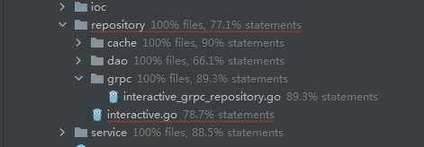
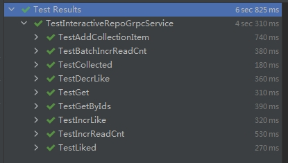

# 其它聚合形态 —— 在 Repository 里面聚合

## 步骤
### 一、基于 interactive/repository/interactive.go ，准备 interactiveRepo.proto
 点击查看：[interactiveRepo.proto](webook/api/proto/intrRepo/v1/interactiveRepo.proto)
 
### 二、生成对应的 grpc 文件
点击查看：[interactiveRepo.pb.go](webook/api/proto/gen/intrRepo/v1/interactiveRepo.pb.go)  
点击查看：[interactiveRepo_grpc.pd.go](webook/api/proto/gen/intrRepo/v1/interactiveRepo_grpc.pb.go)   

### 三、在 repository 实现该 grpc  
点击查看：[interactive_grpc_repository.go](https://github.com/Gnoloayoul/JGEBCamp/blob/main/webook/interactive/repository/grpc/interactive_grpc_repository.go)  
对应的聚合测试：[interactive_Repo_grpc_test.go](https://github.com/Gnoloayoul/JGEBCamp/blob/main/webook/interactive/integration/interactive_Repo_grpc_test.go)    

### 四、在 ArticleRepository 里面完成 Interactive 相关的组装
在这里，我有两个思路。  
- **思路一**
现在已经有了 interactiveRepository 的 grpc server 端，直接把它放进 ArticleRepository 里完成组装。  
- **思路二**   
继续把 interactiveRepository 对应的 grpc client 端给实现出来，然后把这个 client 端放进ArticleRepository 里完成组装。     

相比于思路一，思路二还有很多活要做，但是要实践 DDD 的思想，还得是按思路二来走。     
同样的，也跟课程里一样，也实现类似的灰度调用的 client 。     
本地 client ：[intr_Repo_local.go](https://github.com/Gnoloayoul/JGEBCamp/blob/main/webook/internal/web/client/intr_local.go)   
远程 client ：[grey_scale_intr_Repo.go](https://github.com/Gnoloayoul/JGEBCamp/blob/main/webook/internal/web/client/grey_scale_intr.go)   
ioc init ：[intrRepo.go](https://github.com/Gnoloayoul/JGEBCamp/blob/main/webook/ioc/intrRepo.go)   
距离完全能用，还要将该 ioc init 写进 wire 里，但不妨碍将其 client 与 ArticleRepository 结合起来。     
点击查看[ArticleRepository](https://github.com/Gnoloayoul/JGEBCamp/blob/main/webook/internal/repository/article/article.go) 里注释为 `// week10 homework` 处。

