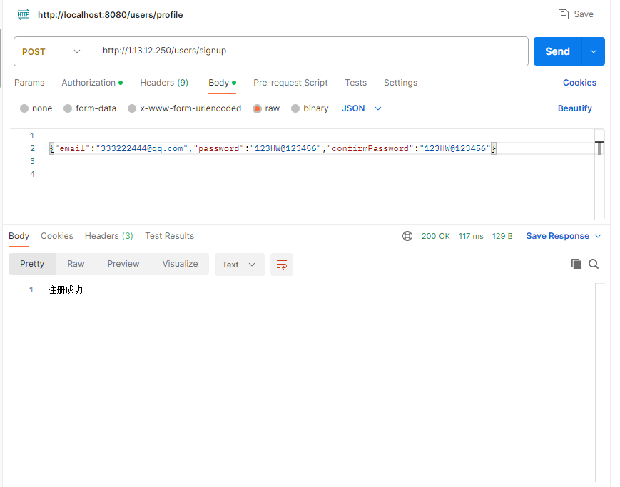
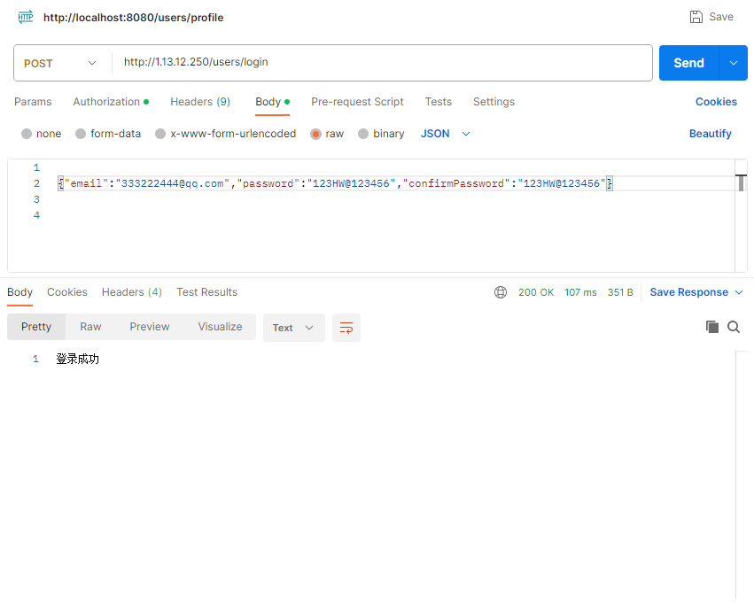
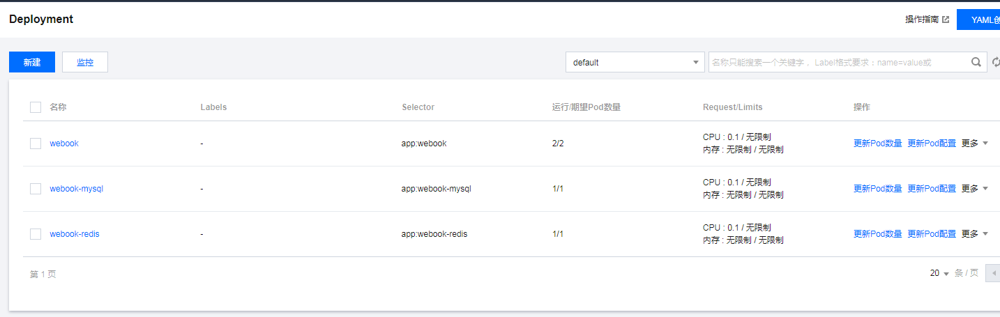
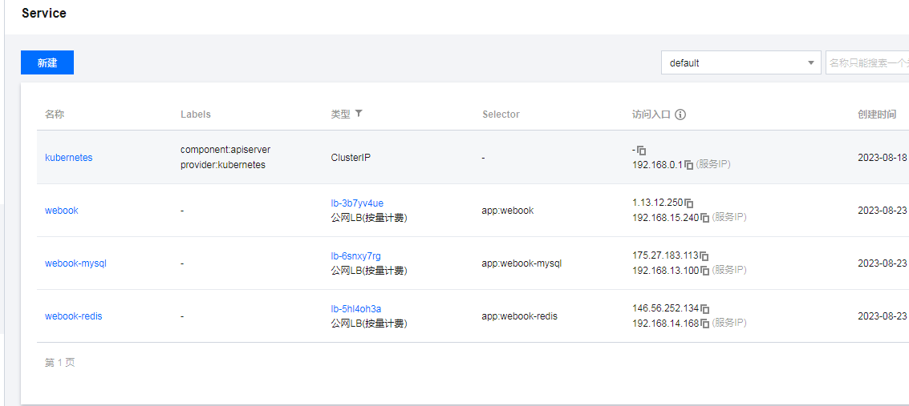
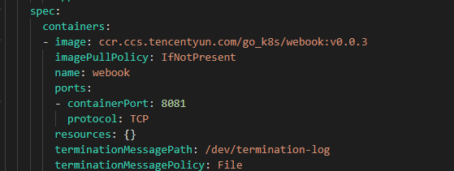
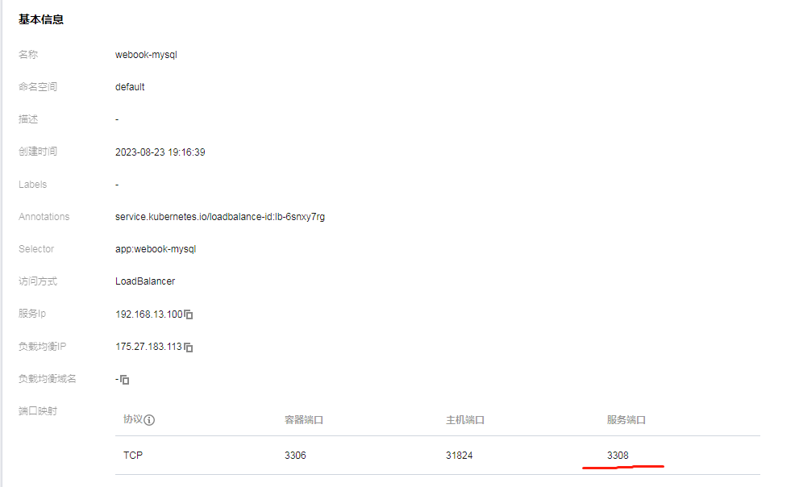
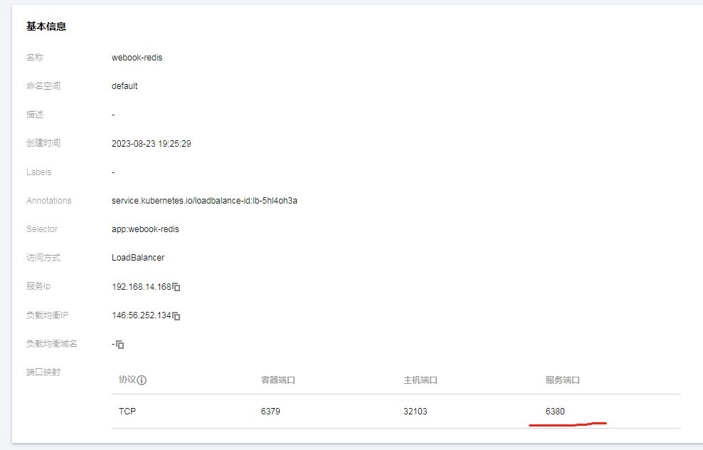

# week3 作业

## 响应
#### 【说明】作业要求是浏览器上的响应，但 /hello 返回 401 的bug未处理，因此在这里只放 postman 的 /users/signup 与 /users/login 响应

## kubectl get pods 
#### 【说明】部署在腾讯云的 Serverless 集群

## kubectl get services
#### 【说明】部署在腾讯云的 Serverless 集群

### webook 的 port

### mysql 的 port

### redis 的 port
