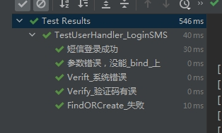

## 测试对象  
[web.LoginSMS](C:\Users\Administrator\Desktop\JGEBCamp\webook\internal\web\user.go)

## 测试
[web.TestUserHandler_LoginSMS](C:\Users\Administrator\Desktop\JGEBCamp\webook\internal\web\user_test.go)

## 测试结果
