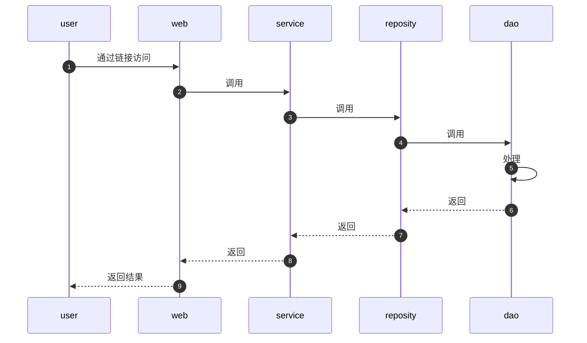

# 第八次作业：找出点赞数量前 N 的数据   
## 代码位置  
web层：   
server层：  
repo层：  
dao层：

## 时序图 
### 缓存命中时  

### 缓存未命中   

## 性能测试结果  

```mermaid
sequenceDiagram
autonumber
user ->> web: 通过链接访问
web ->> service: 调用
service ->> reposity: 调用
reposity ->> dao: 调用
dao ->> dao: 处理
dao -->> reposity: 返回
reposity -->> service: 返回
service -->> web: 返回
web -->> user: 返回结果
```
