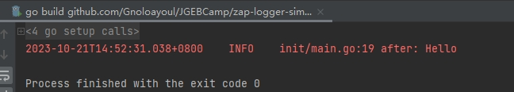
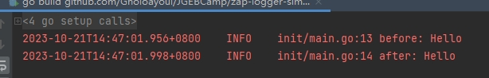

# 初始化 zap-logger 后，别忘记 zap.ReplaceGlobals(logger)
## 示例1
````
zap.L().Info("before Hello")
zap.ReplaceGlobals(logger)
zap.L().Info("after Hello")
````

## 示例2
````
zap.ReplaceGlobals(logger)
zap.L().Info("before: Hello")
zap.L().Info("after: Hello")
````
